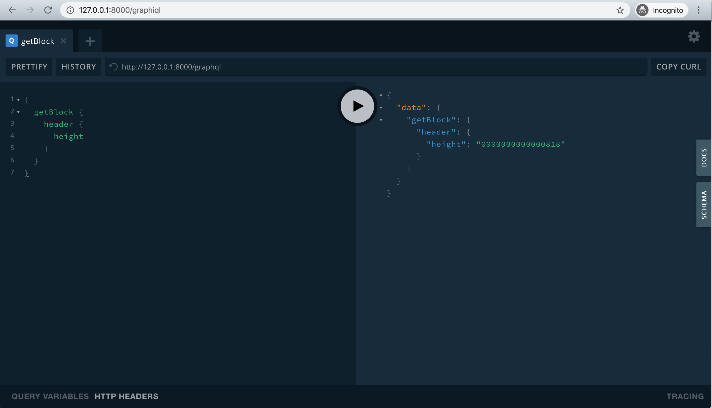

# Muta 入门

<details>
  <summary><strong>Table of Contents</strong></summary>

- [Muta 入门](#muta-%e5%85%a5%e9%97%a8)
  - [安装和运行](#%e5%ae%89%e8%a3%85%e5%92%8c%e8%bf%90%e8%a1%8c)
    - [安装依赖](#%e5%ae%89%e8%a3%85%e4%be%9d%e8%b5%96)
      - [MacOS](#macos)
      - [ubuntu](#ubuntu)
      - [centos7](#centos7)
      - [archlinux](#archlinux)
    - [直接下载预编译的二进制文件](#%e7%9b%b4%e6%8e%a5%e4%b8%8b%e8%bd%bd%e9%a2%84%e7%bc%96%e8%af%91%e7%9a%84%e4%ba%8c%e8%bf%9b%e5%88%b6%e6%96%87%e4%bb%b6)
    - [从源码编译](#%e4%bb%8e%e6%ba%90%e7%a0%81%e7%bc%96%e8%af%91)
      - [获取源码](#%e8%8e%b7%e5%8f%96%e6%ba%90%e7%a0%81)
      - [安装 RUST](#%e5%ae%89%e8%a3%85-rust)
      - [编译](#%e7%bc%96%e8%af%91)
    - [运行单节点](#%e8%bf%90%e8%a1%8c%e5%8d%95%e8%8a%82%e7%82%b9)
  - [与链进行交互](#%e4%b8%8e%e9%93%be%e8%bf%9b%e8%a1%8c%e4%ba%a4%e4%ba%92)
    - [使用 GraphiQL 与链进行交互](#%e4%bd%bf%e7%94%a8-graphiql-%e4%b8%8e%e9%93%be%e8%bf%9b%e8%a1%8c%e4%ba%a4%e4%ba%92)
    - [使用 muta-cli 与链进行交互](#%e4%bd%bf%e7%94%a8-muta-cli-%e4%b8%8e%e9%93%be%e8%bf%9b%e8%a1%8c%e4%ba%a4%e4%ba%92)
  - [使用示例](#%e4%bd%bf%e7%94%a8%e7%a4%ba%e4%be%8b)
  - [使用 docker 本地部署多节点链](#%e4%bd%bf%e7%94%a8-docker-%e6%9c%ac%e5%9c%b0%e9%83%a8%e7%bd%b2%e5%a4%9a%e8%8a%82%e7%82%b9%e9%93%be)

  </details>

## 安装和运行

### 安装依赖

<!-- tabs:start -->

#### **MacOS**

```
$ brew install autoconf libtool
```

#### **ubuntu**

```
$ apt update
$ apt install -y git curl openssl cmake pkg-config libssl-dev gcc build-essential clang libclang-dev
```

#### **centos7**

```
$ yum install -y centos-release-scl
$ yum install -y git make gcc-c++ openssl-devel llvm-toolset-7

# 打开 llvm 支持
$ scl enable llvm-toolset-7 bash
```

#### **archlinux**

```
$ pacman -Sy --noconfirm git gcc pkgconf clang make
```

<!-- tabs:end -->

### 直接下载预编译的二进制文件

我们会通过 [github releases](https://github.com/nervosnetwork/muta/releases) 发布一些常用操作系统的预编译二进制文件。如果其中包含你的操作系统，可以直接下载对应的文件。

### 从源码编译

#### 获取源码

通过 git 下载源码：

```
$ git clone https://github.com/nervosnetwork/muta.git
```

或者在 [github releases](https://github.com/nervosnetwork/muta/releases) 下载源码压缩包解压。

#### 安装 RUST

在 Unix 平台上，执行 `curl https://sh.rustup.rs -sSf | sh`；在 Windows 平台上，下载并运行 [rustup-init.exe](https://static.rust-lang.org/rustup/dist/i686-pc-windows-gnu/rustup-init.exe)。

#### 编译

```
$ cd /path/to/muta
$ cargo build --release --example muta-chain
```

编译完成后的二进制文件在 `target/release/examples/muta-chain`。

### 运行单节点

```
$ cd /path/to/muta

# 使用默认配置运行 muta
# 如果是直接下载的 binary，请自行替换下面的命令为对应的路径
$ ./target/release/examples/muta-chain
```

## 与链进行交互

链默认在 8000 端口暴露了 GraphQL 接口用于用户与链进行交互。

### 使用 GraphiQL 与链进行交互

打开 <http://127.0.0.1:8000/graphiql> 后效果如下图所示：



左边输入 GraphQL 语句，点击中间的执行键，即可在右边看到执行结果。

点击右边 Docs 可以查阅接口文档。更多 GraphQL 用法可以参阅 [官方文档](https://graphql.org/)。

### 使用 muta-cli 与链进行交互

我们通过 [muta-sdk](./js_sdk) 和 nodejs 封装了一个交互式命令行，可以更方便的与 muta 进行交互。

```bash
$ npm install -g muta-cli@0.2.0

$ muta-cli repl
> await client.getLatestBlockHeight()
2081
> await client.getBlock('0x1'){
  header: {
    chainId: '0xb6a4d7da21443f5e816e8700eea87610e6d769657d6b8ec73028457bf2ca4036',
    confirmRoot: [],
    cyclesUsed: [],
    execHeight: '0x0000000000000000',
    height: '0x0000000000000001',
    orderRoot: '0x56e81f171bcc55a6ff8345e692c0f86e5b48e01b996cadc001622fb5e363b421',
    orderSignedTransactionsHash: '0x56e81f171bcc55a6ff8345e692c0f86e5b48e01b996cadc001622fb5e363b421',
    prevHash: '0xeef97d023ef645af469ae67be3e308bd23ebff305fc79ed972941db2f5318e52',
    proof: {
      bitmap: '0x',
      blockHash: '0x56e81f171bcc55a6ff8345e692c0f86e5b48e01b996cadc001622fb5e363b421',
      height: '0x0000000000000000',
      round: '0x0000000000000000',
      signature: '0x'
    },
    proposer: '0xf8389d774afdad8755ef8e629e5a154fddc6325a',
    receiptRoot: [],
    stateRoot: '0xf72a09eb2e79c3c5195401a3efc61c8d0a195f9a00b8579495b29cbfa054382a',
    timestamp: '0x0000017352d8b65a',
    validatorVersion: '0x0000000000000000',
    validators: [ [Object] ]
  },
  orderedTxHashes: [],
  hash: '0x43e1dfe5d78ee5b74b1c321f80ebee3c9c424d4354f12035276cc40aa8452315'
}
```

该 REPL 是基于 nodejs 的封装，你可以使用任何符合 nodejs 语法的语句。

环境中默认注入了一些变量，方便使用：
- `muta_sdk`: 即 muta-sdk 库，更多使用方法可以参考 [muta-sdk 文档](https://nervosnetwork.github.io/muta-sdk-js/)
- `muta`: muta 链的 instance
- `client`: 对链进行 GraphQL 调用的 client
- `wallet`: 根据助记词（默认为随机生成）推导出的钱包
- `accounts`: 根据 wallet 推导出的 20 个账号

## 使用示例

以下使用 muta-cli 对链的常用操作进行简单的示例说明：

```bash
$ muta-cli repl
# 链基础交互
> await client.getLatestBlockHeight()
2081

> client.getBlock('0x1')
{
  header: {
    chainId: '0xb6a4d7da21443f5e816e8700eea87610e6d769657d6b8ec73028457bf2ca4036',
    confirmRoot: [],
    cyclesUsed: [],
    execHeight: '0x0000000000000000',
    height: '0x0000000000000001',
    orderRoot: '0x56e81f171bcc55a6ff8345e692c0f86e5b48e01b996cadc001622fb5e363b421',
    orderSignedTransactionsHash: '0x56e81f171bcc55a6ff8345e692c0f86e5b48e01b996cadc001622fb5e363b421',
    prevHash: '0xeef97d023ef645af469ae67be3e308bd23ebff305fc79ed972941db2f5318e52',
    proof: {
      bitmap: '0x',
      blockHash: '0x56e81f171bcc55a6ff8345e692c0f86e5b48e01b996cadc001622fb5e363b421',
      height: '0x0000000000000000',
      round: '0x0000000000000000',
      signature: '0x'
    },
    proposer: '0xf8389d774afdad8755ef8e629e5a154fddc6325a',
    receiptRoot: [],
    stateRoot: '0xf72a09eb2e79c3c5195401a3efc61c8d0a195f9a00b8579495b29cbfa054382a',
    timestamp: '0x0000017352d8b65a',
    validatorVersion: '0x0000000000000000',
    validators: [ [Object] ]
  },
  orderedTxHashes: [],
  hash: '0x43e1dfe5d78ee5b74b1c321f80ebee3c9c424d4354f12035276cc40aa8452315'
}

# asset service 操作
> const account = accounts[0]

> const as = new service.AssetService(client, account)

# 发行资产
> const MT = await as.write.create_asset({name: 'Muta Token', supply: 1000000000, symbol: 'MT'})
{
  txHash: '0x78f05d81d56b5ebc8e3b3e4b76dd0928e963d5c0e53c14003ef135ef3b63b33a',
  height: '0x0000000000000738',
  cyclesUsed: '0x0000000000005208',
  events: [
    {
      data: '{"id":"0x7d7d6c2445f8938e0dfba6f6c16ac431798908ad02e363c44aa8c8a961840af0","name":"Muta ' +
        'Token","symbol":"MT","supply":1000000000,"issuer":"0x9881aac16b9cc6386bd222bc365be07ee375e842"}',
      service: 'asset'
    }
  ],
  stateRoot: '0x37024b87295d339f9e3763f0f02d5f91e94c602e72cfea9455ed75627eebe979',
  response: {
    serviceName: 'asset',
    method: 'create_asset',
    response: {
      code: '0x0000000000000000',
      errorMessage: '',
      succeedData: [Object]
    }
  }
}

> const asset_id = MT.response.response.succeedData.id

# 发行者即为发交易的账户地址
> account.address
'0x9d1d1bb11c44500603971a245f55a23f65148eee'

# 查询发行者余额
> await client.queryService({serviceName: 'asset', method: 'get_balance', payload: JSON.stringify({asset_id: asset_id, user: account.address})})
{ 
  isError: false,
  ret: '{"asset_id":"0xe8c2c6606030bc93da018cec5e6400845489b471527d507357b3316ae884a3f3","user":"0x9d1d1bb11c44500603971a245f55a23f65148eee","balance":1000000000}' 
}

# 转账
> const to = accounts[1].address;

> await as.write.transfer({asset_id: asset_id, to, value: 100});
{
  txHash: '0xffa7e55465695b6f50617c4abb472fb55142577dcd9f2069fef02d28b1b7f8f5',
  height: '0x000000000000074f',
  cyclesUsed: '0x0000000000005208',
  events: [
    {
      data: '{"asset_id":"0x7d7d6c2445f8938e0dfba6f6c16ac431798908ad02e363c44aa8c8a961840af0","from":"0x9881aac16b9cc6386bd222bc365be07ee375e842","to":"0x46a31f791466ba6a13ccddf9c180ff2ee5a60564","value":100}',
      service: 'asset'
    }
  ],
  stateRoot: '0x8348541d8e36e07cec6db6e2728f0c185370fbfa309799447286849064590722',
  response: {
    serviceName: 'asset',
    method: 'transfer',
    response: { code: '0x0000000000000000', errorMessage: '', succeedData: {} }
  }
}

# 查看转账结果
> await client.queryService({ serviceName: 'asset', method: 'get_balance', payload: JSON.stringify({asset_id: asset_id, user: account.address})})
{
  code: '0x0000000000000000',
  errorMessage: '',
  succeedData: '{"asset_id":"0x7d7d6c2445f8938e0dfba6f6c16ac431798908ad02e363c44aa8c8a961840af0","user":"0x9881aac16b9cc6386bd222bc365be07ee375e842","balance":999999900}'
}

> await client.queryService({ serviceName: 'asset', method: 'get_balance', payload: JSON.stringify({asset_id: asset_id, user: to})})
{
  code: '0x0000000000000000',
  errorMessage: '',
  succeedData: '{"asset_id":"0x7d7d6c2445f8938e0dfba6f6c16ac431798908ad02e363c44aa8c8a961840af0","user":"0x46a31f791466ba6a13ccddf9c180ff2ee5a60564","balance":100}'
}

# 链上管理
> admin = muta_sdk.Muta.account.fromPrivateKey('0x2b672bb959fa7a852d7259b129b65aee9c83b39f427d6f7bded1f58c4c9310c2')

> admin.address
'0xcff1002107105460941f797828f468667aa1a2db'

> metadata_raw = await client.queryService({serviceName: 'metadata', method: 'get_metadata', payload: ''})
{
  code: '0x0000000000000000',
  errorMessage: '',
  succeedData: '{
    "chain_id":"0xb6a4d7da21443f5e816e8700eea87610e6d769657d6b8ec73028457bf2ca4036",
    "common_ref":"0x703873635a6b51513451",
    "timeout_gap":20,
    "cycles_limit":1000000,
    "cycles_price":1,
    "interval":3000,
    "verifier_list":[
      {
        "bls_pub_key":"0x04188ef9488c19458a963cc57b567adde7db8f8b6bec392d5cb7b67b0abc1ed6cd966edc451f6ac2ef38079460eb965e890d1f576e4039a20467820237cda753f07a8b8febae1ec052190973a1bcf00690ea8fc0168b3fbbccd1c4e402eda5ef22",
       "address":"0xf8389d774afdad8755ef8e629e5a154fddc6325a",
       "propose_weight":1,
       "vote_weight":1
      }
      ],
      "propose_ratio":15,
      "prevote_ratio":10,
      "precommit_ratio":10,
      "brake_ratio":7,
      "tx_num_limit":20000,
      "max_tx_size":1024
    }'
}
```

## 使用 docker 本地部署多节点链

需要预先安装 [docker](https://www.docker.com/)。

1. 构建 docker 镜像

```bash
cd /path/to/muta

make docker-build
```

2. 运行 docker compose 命令起链

```bash
docker compose -f devtools/docker/dockercompose/bft-4-node.yaml up
```

Docker compose 启动 4 个共识节点，分别暴露 GraphQL 本地端口 8001、8002、8003、8004，节点的详细配置信息可前往 `devtools/docker/dockercompose` 目录查看。
